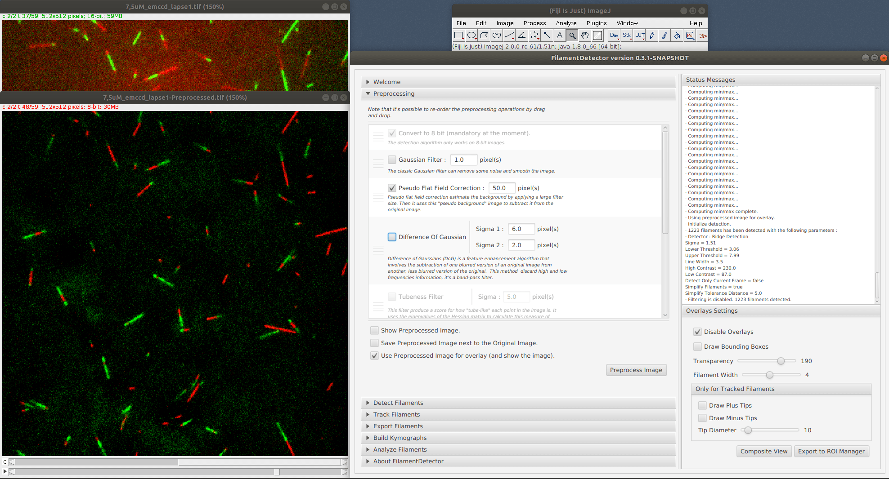
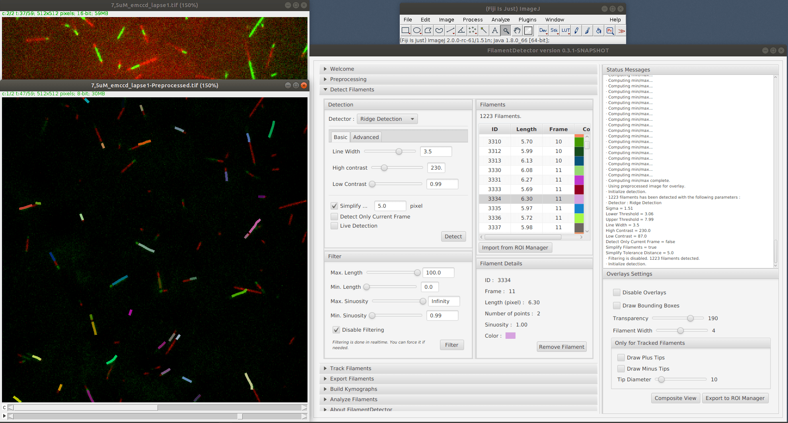
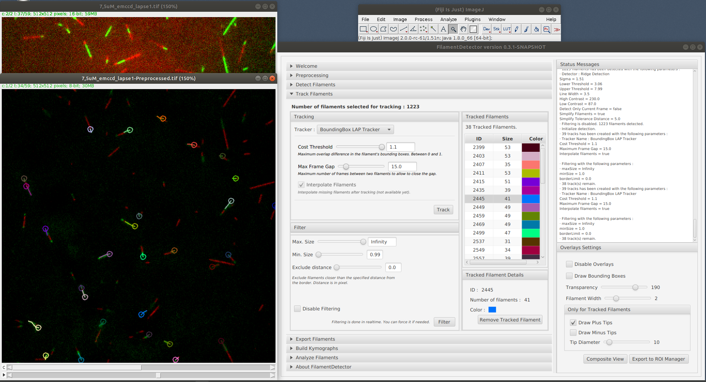
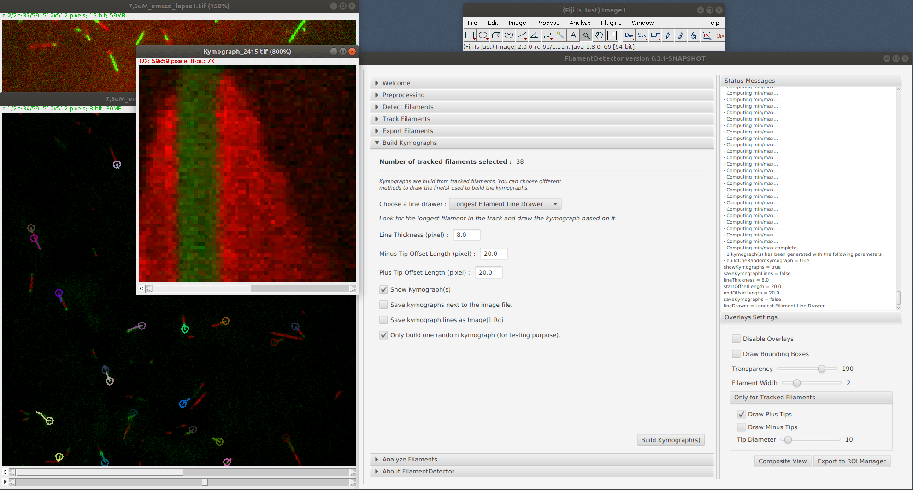

# FilamentDetector

`FilamentDetector` is a **Fiji plugin** that allows easy, fast and accurate detection and tracking of **biological filaments**. It comes with a bunch of **ready-to-use modules** to analyze filaments. `FilamentDetector` is also extensible which means that you can plug **your own algorithm** to detect, track and/or analyze filaments.

ImageJ Wiki page: https://imagej.net/FilamentDetector.

## Screenshots

### Preprocess images

### Detect filaments

### Track filaments

### Generate kymographs

### Run more analysis

## Installation

- Start [Fiji](https://imagej.net/Fiji/Downloads).
- Click on `Help ▶ Update...`.
- In the new window, click on `Manage update sites`.
- Scroll to find `FilamentDetector` in the column `Name`. Click on it.
- Click `Close` and then `Apply changes`.
- Restart Fiji.
- Open your image.
- Then you can start the plugin with `Plugins ► Tracking ► FilamentDetector`.

## Authors

`FilamentDetector` has been created by [Hadrien Mary](mailto:hadrien.mary@gmail.com).

This work started in 2016 at the [Gary Brouhard laboratory](http://brouhardlab.mcgill.ca/) at the University of McGill.

## License

MIT. See [LICENSE.txt](LICENSE.txt)
