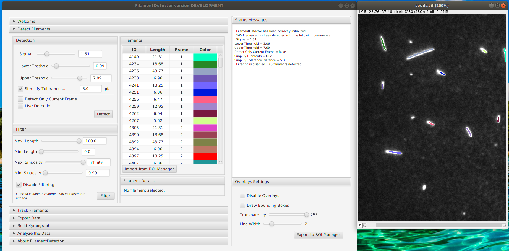

**Important**: *This plugin is in heavy development and not yet suitable for use*.

# FilamentDetector

`FilamentDetector` is a **Fiji plugin** that allow easy, fast and accurate detection and tracking of **biological filament**.

Please visit https://imagej.net/FilamentDetector for more information.

## Installation

- Download the last released version [here](http://maven.imagej.net/service/local/artifact/maven/redirect?r=releases&g=org.scijava&a=FilamentDetector&v=RELEASE&e=jar).
- Copy the .jar file to your Fiji plugins directory.
- Launch Fiji.
- You can run the plugin with `Plugins ► Tracking ► FilamentDetector`.

## Authors

`FilamentDetector` has been created by [Hadrien Mary](mailto:hadrien.mary@gmail.com).

This work started in 2016 at the [Gary Brouhard laboratory](http://brouhardlab.mcgill.ca/) at the University of McGill.

## License

MIT. See [LICENSE.txt](LICENSE.txt)
