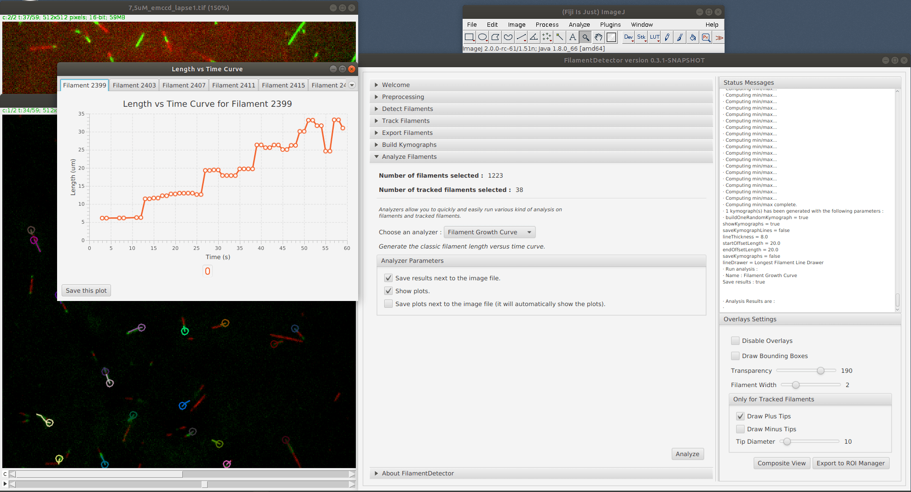

# FilamentDetector

`FilamentDetector` is a **Fiji plugin** that allows easy, fast and accurate detection and tracking of **biological filaments**. It comes with a bunch of **ready-to-use modules** to analyze filaments. `FilamentDetector` is also extensible which means that you can plug **your own algorithm** to detect, track and/or analyze filaments.

ImageJ wiki page: https://imagej.net/FilamentDetector.

## Installation

`FilamentDetector` is included with Fiji. Just open your image,
then start the plugin with `Plugins ► Tracking ► FilamentDetector`.

## How to cite

Since there is no published article about `FilamentDetector` at the moment you can use the DOI generated by Zenodo to cite `FilamentDetector` in your work: https://doi.org/10.5281/zenodo.2544848

## Screenshots

### Preprocess images

### Detect filaments

### Track filaments

### Generate kymographs

### Run more analysis

## Authors

`FilamentDetector` has been created by [Hadrien Mary](mailto:hadrien.mary@gmail.com).

This work started in 2016 at the [Gary Brouhard laboratory](http://brouhardlab.mcgill.ca/) at the University of McGill.

## License

MIT. See [LICENSE.txt](LICENSE.txt)
